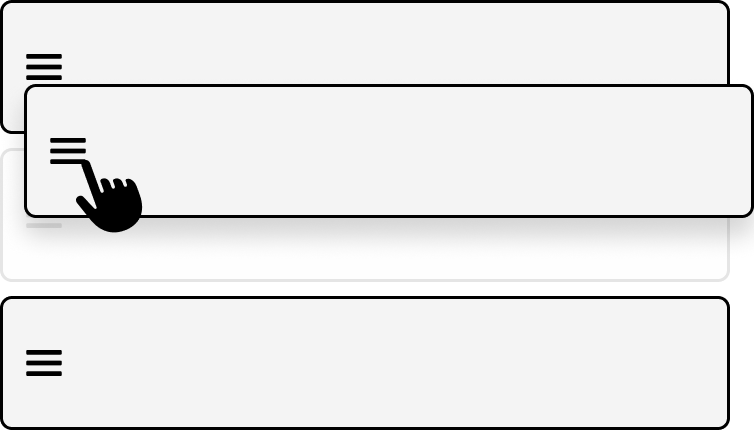
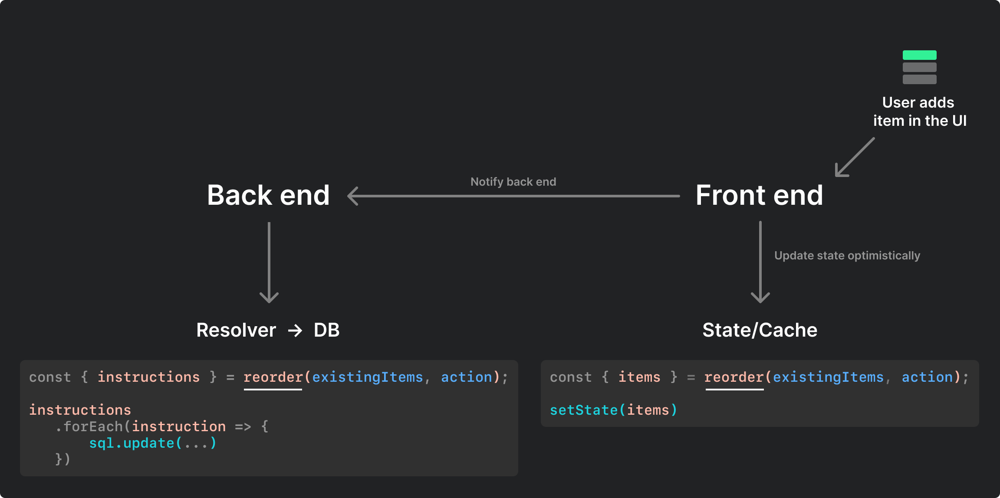

<h1 align="center">reorder-items</h1>

<p align="center">A helpful algorithm for persisting the order of items.</p>

<p align="center">0.7kb minified + gzipped &bull; No dependencies &bull; <a href="#usage">How to use it</a></p>

<div align="center">
    <a href="https://www.travis-ci.com/martenbjork/reorder-items">
        
    </a>
</div>

## Use case

You're building a UI containing lists. Users can change the order of items in the lists. (Trello, Todoist...) 



Your database stores the items along with an `order` field:
```
ID                                    | Order
--------------------------------------|------------------------
af84c0bd-342d-4495-b16d-2aadf3cb74b3  | 0
e34094bf-e62a-4056-b145-d5698cf8bb9d  | 1
```

Your front end fetches these items and stores them as state:

```ts
[
  {
    id: "af84c0bd-342d-4495-b16d-2aadf3cb74b3",
    order: 0,
  },
  {
    id: "e34094bf-e62a-4056-b145-d5698cf8bb9d",
    order: 1,
  },
]
```

#### The tricky part

- When an item is added, removed or moved, the data above needs to be re-calculated.
    - **Adding items:** The new item needs a correct `order` value. Items below need to have their `order` increased by 1 since they are pushed down by the new item.
    - **Removing items:** Suddenly there is a gap in the `order` sequence. Remaining items (below the removed one) need to have their `order` reduced by 1.
    - **Moving items:** All items below the new one needs new `order` values since they were also moved (as a side effect).

- These changes need to be instantaneous in the state & UI. They also need to be persisted on the back end.

- This logic needs to be predictable and rock solid so that the UI and back end has the same `order` values.

<strong>🌸 This package helps you implement this logic without headaches.</strong>

## Usage

<pre align="center">
   const { instructions, items }  =  reorder(currentItems, action);
</pre>

 <table>
 <tbody>
 <tr>
 <th colspan="2"><div align="center">What reorder() returns 👆</div></th>
 <th colspan="2"><div align="center">👆 Your inputs</div></th>
 </tr>
    <tr>
        <td width="25%" valign="top">
            <p><code>instructions</code> tell you what changes <i>you</i> need to be make to the existing data in order to achieve the desired state.</p>

<p>This is useful when you need to persist changes to a database.</p>


```ts
type Instruction = 
  | InsertInstruction 
  | RemoveInstruction
  | UpdateInstruction; 

type InsertInstruction = {
  type: "INSERT";
  item: OrderedItem;
};

type UpdateInstruction = {
  type: "UPDATE";
  id: ID;
  order: number;
};

type RemoveInstruction = {
  type: "REMOVE";
  id: ID;
};
```

</td>
<td width="25%" valign="top">
<p><code>items</code> is a new array with all the changes already applied. Ready to go!</p>
</td>
<td width="25%" valign="top">
<p><code>currentItems</code> is an array of objects.</p>
</td>
<td width="25%" valign="top">
  <p><code>action</code> is a redux-like action that expresses the change that you want to make to the list.</p>

```ts
type Action = 
  | InsertAction 
  | RemoveAction 
  | MoveAction;

type InsertAction = {
  type: "INSERT";
  item: IdItem;
  order: number;
  column?: number;
};

type RemoveAction = {
  type: "REMOVE";
  id: ID;
};

type MoveAction = {
  type: "MOVE";
  id: ID;
  toOrder: number;
  toColumn?: number;
};
```

  </td>
</tr>

  </tbody>
</table>

## Example implementation



### Step 1: Fetching data

Your UI contains a list of cities. 

```ts
const [cities, setCities) = useState([]);
```

City data can be fetched at `/api/getCityList`:

```ts
[
  {
    id: "af84c0bd-342d-4495-b16d-2aadf3cb74b3",
    order: 0,
    title: "Stockholm",
  },
  {
    id: "e34094bf-e62a-4056-b145-d5698cf8bb9d",
    order: 1,
    title: "Ottawa",
  }
]
```
We fetch these items and put them in the state:

```ts
setCities(res.data.getCityList);
```

Now we got cities in the state. We show the cities in the UI.

### Step 2: Adding to the list

Users can add a new city to the list. We set up a handler for this:

```ts
const addCity = (title: string, order: number) => {
  // Describe what needs to happen
  const action : Action = {
    action: "INSERT",
    item: { id: uuid(), title },
    order,
  };

  // Compute new values for the list
  const { items: updatedCities } = reorder(cities, action);

  // Save to state
  setCities(updatedCities)
}
```

Because `reorder` took care of the logic, the `cities` state now contains the right values:

<table>
<tbody>
<tr>
<th>Old state</th>
<th>New state</th>
</tr>
<tr>
<td valign="top">

```ts
[
  {
    id: "af84c0bd-342d-4495-b16d...",
    order: 0,
    title: "Stockholm",
  },
  {
    id: "e34094bf-e62a-4056-b145...",
    order: 1,
    title: "Ottawa",
  }
]
```
</td>

<td valign="top">

```ts
[
  // New item
  {
    id: "b5f2ebcd-41c2-427e-a8fb...",
    order: 0,
    title: "Amsterdam",
  },
  // Previous items (now updated)
  {
    id: "af84c0bd-342d-4495-b16d...",
    order: 1, // Increased by 1
    title: "Stockholm",
  },
  {
    id: "e34094bf-e62a-4056-b145...",
    order: 2, // Increased by 1
    title: "Ottawa",
  }
]
```
</td>
</tr>
</tbody>
</table>

### Step 3: Persisting the changes

The updated list is now reflected in the UI, but we still need to persist the order to the back end. We send an API request to the `addCity` endpoint. 

```ts
request({
  endpoint: '/api/addCity',
  data: {
    id,
    title, 
    order
  }
});
```

On the server, a resolver handles the request. It too uses the `order` function that we already used on the front end.

```ts
const addCityResolver = (args: MutationArgs) => {
  // Fetch the existing items
  const cities = getMyCities();

  // Describe what needs to happen
  const action : Action = {
    action: "INSERT",
    item: { id: args.id, title: args.title },
    order: args.order,
  };

  // Run the same function that we ran on the front end.
  // Because we can't write JavaScript objects directly
  // to the database, we use the `instructions` to figure
  // out what changes we need to make to the database.
  const { instructions } = reorder(cities, action);

  // Loop through the instructions
  // and do what they tell us.
  instructions.forEach(instruction => {
    switch(instruction.type) {
      case "INSERT";
        db.cities.insert({
          ...instruction.item
        });
        break;

      case "UPDATE":
        db.cities.update({
          where: {
            id: instruction.id,
          },
          data: {
            order: instruction.order
          }
        });
        break;
    }
  })
}
```

Because the front end and back end both used the `reorder` function to compute new list values, they end up with the same result.

The data is now the same in the state and database. 🌸

--- 

## Details

### Performance

Performance testing and profiling is done through the browser:

https://reorder-items.netlify.app

### Order

Items and instructions may be returned in any order. This allows the underlying algoritm to simply ignore the order of the results and instead optimize for speed.

### Sources

https://blog.logrocket.com/publishing-node-modules-typescript-es-modules/
